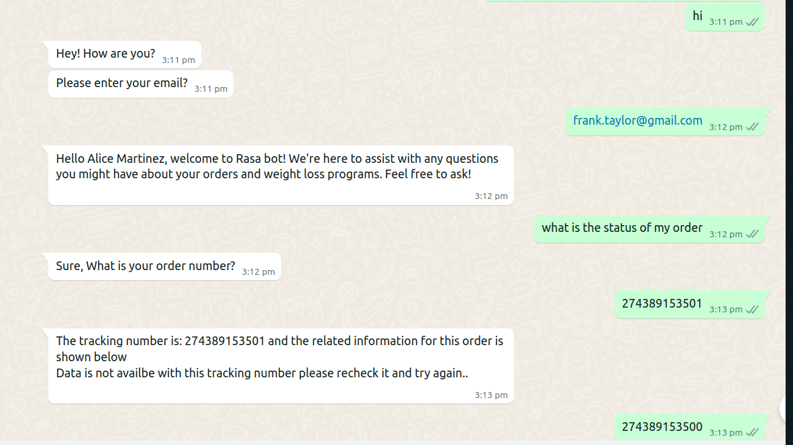

# RASA CHATBOT

This repository contains the code for the Shipment Tracking and Healtcare related Domain questions. The goal of this project is to create an interactive chatbot that allows users to track the status of their shipment orders and handle queries related to helthcare domain and weight loss programs, including 3-month, 6-month, and trial plans. The chatbot uses Rasa for natural language understanding and dialogue management, integrates with shipment tracking APIs, and utilizes a web interface for user interaction.


## Table of Contents

- [Introduction](#introduction)
- [Features](#features)
- [Technologies Used](#technologies-used)
- [Setup Instructions](#setup-instructions)
- [Usage](#usage)


## Introduction
This Chatbot project simplifies the process of tracking shipment orders and querying information related to Healhcare domain It leverages state-of-the-art natural language understanding models and provides a user-friendly interface to interact with users.

## Features

- **Email verify**: Verify the email to check user is existing or not in real time.
- **Order Tracking**: Track the status of shipment orders in real-time.
- **Plans for weight loss**: you can ask questions related to plans for weight loss.
- **Interactive Q&A**: Ask questions and receive answers related to Healthcare Domain.
- **User-Friendly Interface**: Built with a web framework for ease of use.
- **Integration with Shipment APIs**: Retrieves real-time shipment data.
- **Natural Language Understanding** : Utilizes Rasa for robust dialogue management.
- **Integrated to whatsapp using twillo** : The chatbot is integrated with WhatsApp using Twilio for seamless user interaction..


## Technologies Used

- **Rasa**: Framework for building conversational AI.
- **Python**: Programming language for backend development.
- **twilio**: for whatsapp integration.


## Setup Instructions

Follow these steps to set up the project on your local machine:


**1. Clone the Repository**
Begin by cloning the repository to your local machine:
```
https://github.com/langchain-tech/rasa-bot.git
cd rasa-bot
```

**2. Create a Virtual Environment**
It is recommended to create a virtual environment to manage dependencies:
```
python -m venv venv
source venv/bin/activate   # On Windows, use `venv\Scripts\activate`
```

**3. Install Dependencies**
Install the necessary packages listed in the requirements.txt file:
```
pip install -r requirements.txt
```


**4. Start the Application**

Train your Rasa model
```
rasa train
```


## Method to interaact with Rasa bot
**1. Interact using terminal**


In one terminal, run the following command to start the Rasa action server:
```
rasa run actions
```
This command will start the action server, which is responsible for handling custom actions defined in your Rasa project.

In the second terminal, run the following command to start the Rasa shell:
```
rasa shell
```
This command will start an interactive chat interface where you can communicate with your Rasa bot.

Once both servers are running, you can start interacting with your Rasa bot in the shell.


**2. Interact with your Rasa bot in whatsapp using twilio**
1. In one terminal, run the following command to start the Rasa action server:
```
rasa run actions
```
This command will start the action server, which is responsible for handling custom actions defined in your Rasa project.

2. Start your Rasa server by running:
```
rasa run
```
This command will start the Rasa server, allowing it to receive messages and respond accordingly.


3. Use ngrok for Port Forwarding: Ngrok will help you expose your local server to the internet so that Twilio can communicate with it. Run ngrok with the following command:

```
ngrok http 5005
```
This command will create a publicly accessible URL forwarding requests to your local Rasa server.

4. **Set up Twilio**: Sign up for a Twilio account if you haven't already. Once you're logged in, navigate to the Twilio console.

5. **Set Up WhatsApp Integration**: Follow Twilio's instructions to set up a WhatsApp integration. You'll need to verify your phone number and configure a webhook URL.

6. **Configure Webhook URL**: Set the ngrok URL you received in step 3 as the webhook URL in your Twilio console. Make sure to append /webhooks/twilio/webhook to the end of the URL to ensure Twilio routes messages correctly to Rasa.

7. **Test Your Bot**: Once everything is set up, you can start sending messages to your Twilio WhatsApp number. Twilio will forward these messages to your Rasa server via ngrok, and your Rasa bot will respond accordingly.

With these steps completed, you should be able to interact with your Rasa bot via WhatsApp using Twilio as the messaging platform.

## Output

## Usage

- **Track Orders**: Enter your shipment order details to get real-time tracking information.
- **Ask Questions**: Enter your questions related to Healthcare and receive relevant answers.
- **Plans for weight loss**: you can ask questions related to programs for weight loss.