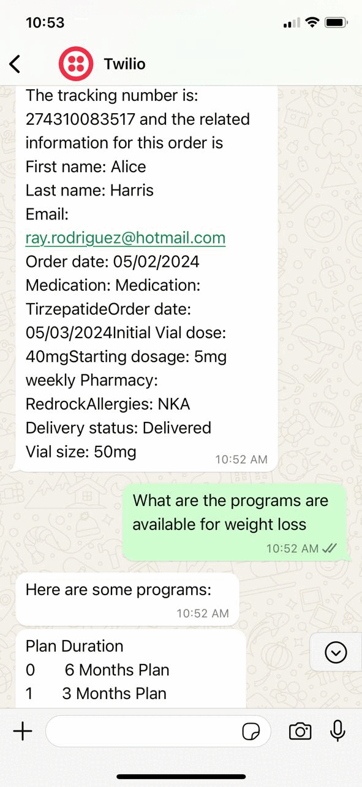

# RASA CHATBOT

This repository contains the code for the Zappy Healthcare Shipment Tracking Chatbot project. The goal of this project is to create an interactive chatbot that allows users to track the status of their shipment orders and handle queries related to Zappy programs, including 3-month, 6-month, and trial plans. The chatbot uses Rasa for natural language understanding and dialogue management, integrates with shipment tracking APIs, and utilizes a web interface for user interaction.


## Table of Contents

- [Introduction](#introduction)
- [Features](#features)
- [Technologies Used](#technologies-used)
- [Setup Instructions](#setup-instructions)
- [Usage](#usage)


## Introduction
The Zappy Healthcare Shipment Tracking Chatbot project simplifies the process of tracking shipment orders and querying information related to Zappy Healthcare services. It leverages state-of-the-art natural language processing models and provides a user-friendly interface to interact with users.

## Features

- **Email verify**: Verify the email to check user is existing or not in real time.
- **Order Tracking**: Track the status of shipment orders in real-time.
- **Plans for weight loss**: you can ask questions related to plans for weight loss.
- **Interactive Q&A**: Ask questions and receive answers related to Zappy Healthcare.
- **User-Friendly Interface**: Built with a web framework for ease of use.
- **Integration with Shipment APIs**: Retrieves real-time shipment data.
- **Natural Language Understanding** : Utilizes Rasa for robust dialogue management.
- **Integrated to whatsapp using twillo** : The chatbot is integrated with WhatsApp using Twilio for seamless user interaction..


## Technologies Used

- **Rasa**: Framework for building conversational AI.
- **Python**: Programming language for backend development.
- **twilio**: for whatsapp integration.


## Setup Instructions

Follow these steps to set up the project on your local machine:


**1. Clone the Repository**
Begin by cloning the repository to your local machine:
```
https://github.com/langchain-tech/zappyhealth-rasa-bot.git
cd zappyhealth-rasa-bot
```

**2. Create a Virtual Environment**
It is recommended to create a virtual environment to manage dependencies:
```
python -m venv venv
source venv/bin/activate   # On Windows, use `venv\Scripts\activate`
```

**3. Install Dependencies**
Install the necessary packages listed in the requirements.txt file:
```
pip install -r requirements.txt
```


**4. Start the Application**

Train your Rasa model
```
rasa train
```


**first method to interaact with Rasa bot in terminal**
Run your rasa bot 
```
rasa shell
```

Run your actions also in another terminal at same time
```
rasa run actions
```

**second method to run you Rasa bot in whatsapp using twilio**
Run your rasa bot 
```
rasa run
```

Run your actions also in another terminal at same time
```
rasa run actions
```

use ngrok for port forwording.
```
ngrok http 5005
```


## Output

## Usage

- **Interact with the Chatbot**: Use the web interface to start a conversation with the chatbot.
- **Track Orders**: Enter your shipment order details to get real-time tracking information.
- **Ask Questions**: Enter your questions related to Zappy Healthcare and receive relevant answers.
- **Plans for weight loss**: you can ask questions related to programs for weight loss.